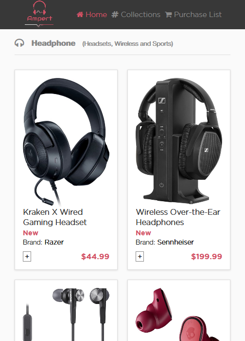
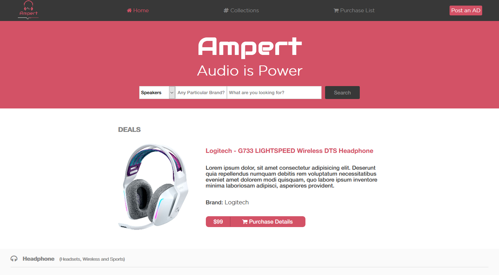

# HTML-CSS Capstone

This project is the last part of Microverse's HTML and CSS module. It consists of two responsive pages of an online audio equipment shop. Design provided by Mohammed Awad on [Behance](https://www.behance.net/gallery/24796463/ZATTIX).

## Built With

- HTML 5
- CSS 3
- Sass

## Live Demo

[Ampert](https://gscarv13.github.io/HTML-CSS-Capstone/)

## Getting Started

Visit the live version on the link above.

To get a local copy follow these simple steps:

- Use `git clone https://github.com/gscarv13/HTML-CSS-Capstone.git`
- Move to the directory where the project was cloned to. 
- Open the index.html file in your browser.

## Authors

👤 **Gustavo Silva de Carvalho**

- GitHub: [@gscarv13](https://github.com/gscarv13)
- Twitter: [@Gscarv13](https://twitter.com/Gscarv13)
- LinkedIn: [Gustavo Carvalho](https://www.linkedin.com/in/gustavo-silva-de-carvalho-72998a156/)

## 🤝 Contributing

Contributions, issues, and feature requests are welcome!

Feel free to leave your suggestion on the [issues page](https://github.com/gscarv13/HTML-CSS-Capstone/issues).

## Show your support

Give a ⭐️ if you like this project!

## 📝 License

This project is [MIT](https://opensource.org/licenses/mit-license.php) licensed.
